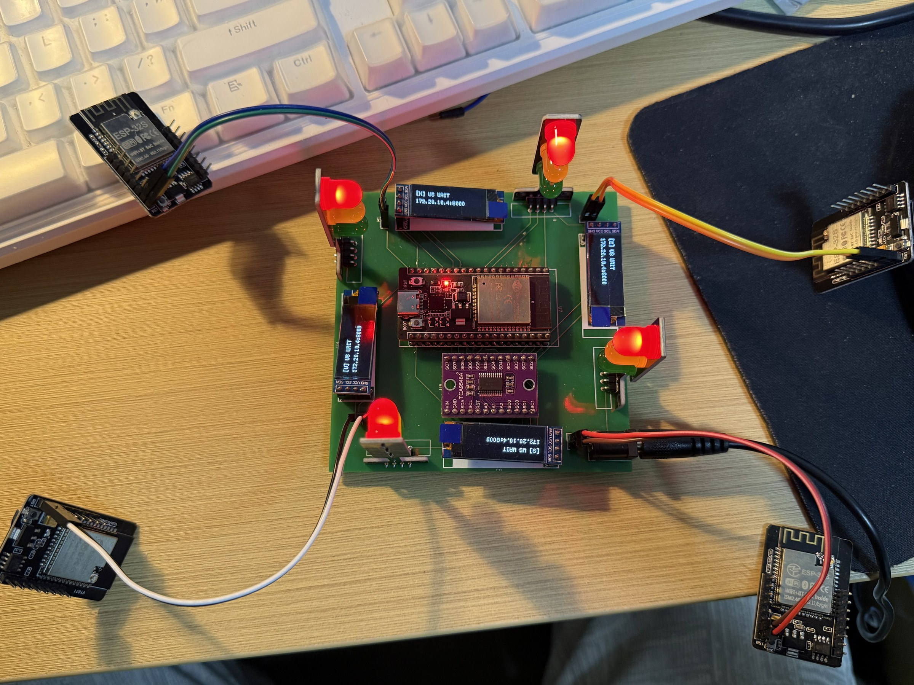

# 车流量自适应交通信号控制系统

一个面向教学与本科毕业设计参考的桌面十字路口原型：四路 ESP32-CAM 提供 MJPEG 视频，后端使用 YOLOv8 / ByteTrack 跟踪并统计车流，FastAPI 与 Vue 3 工作台展示运行事实，主控 ESP32 驱动 12 路交通灯和 4 块 OLED。

[](https://github.com/rongyishuaige7/adaptive-traffic-signal-system/actions/workflows/validate.yml)
[](LICENSE)

> **证据范围（2026-07-17）：** 源码已确认 · 后端测试通过 · 前端构建通过 · 东南西北四路 ESP32-CAM 与主控 ESP32 固件构建通过 · 模拟器契约测试通过 · 当前五板硬件与端到端链路尚未重新真机复测。

本仓库用于展示多板计算机视觉教学原型如何组成闭环。它**不是道路基础设施、认证交通信号控制器，也不证明交通优化效果或车辆检测准确率**。

## Historical material evidence (2026-07-18 publication)

sanitized historical photo(s), sanitized historical screenshot(s), historical EDA derivative(s). See [MEDIA_EVIDENCE](docs/MEDIA_EVIDENCE.md) for dates, sanitization, omissions, and evidence limits.



Historical media/EDA do not prove that the current public commit was flashed or re-tested on hardware. **Current hardware re-test not run.**


## 项目能力

- 东、南、西、北四路 AI Thinker ESP32-CAM 固件，使用 DHCP 与 MJPEG 端点；
- 四路后端工作线程，基于 YOLOv8 / ByteTrack 跟踪车辆并统计虚拟线穿越次数；
- 南北、东西两相位状态机，以有界线性公式计算下一轮绿灯时间；
- FastAPI 状态接口、MJPEG 转发以及 UI / 设备 WebSocket；
- Vue 3 工作台分别展示 UI 连接、设备客户端数量和近期视频帧事实；
- 主控 ESP32 驱动 12 路灯光，并通过 TCA9548A 连接 4 块 SSD1306 OLED；
- 四路合成 MJPEG 源和终端主控模拟器，便于在无硬件时学习与验证；
- 从当前源码整理的 BOM 与接线边界。

## 系统架构

```text
ESP32-CAM 东/南/西/北 ── MJPEG ──┐
                                  ▼
                       FastAPI + YOLOv8/ByteTrack
                                  │
                    ┌─────────────┴────────────┐
                    │ UI WebSocket + MJPEG     │ 设备 WebSocket
                    ▼                          ▼
                 Vue 3 界面              ESP32 主控制器
                                              │          │
                                         12 路灯光    TCA9548A
                                                         │
                                                  4 × SSD1306
```

## 仓库结构

```text
backend/                 FastAPI、车流统计、配时与 WebSocket 服务
frontend/                Vue 3 / Element Plus / ECharts 工作台
firmware/esp32_cam/      东/南/西/北 AI Thinker ESP32-CAM 固件
firmware/esp32_main/     12 路灯光 + 4 块 OLED 的 ESP32 主控固件
simulator/               本地模拟摄像头与模拟主控工具
tests/                   不依赖硬件的后端与模拟器契约测试
hardware/                从源码整理的 BOM 与接线边界图
docs/                    部署、状态、验证与来源说明
scripts/                 敏感信息、仓库结构与完整验证门禁
```

## 快速验证

下面的一键门禁不使用真实凭据、不下载模型，也不连接硬件：

```bash
bash scripts/verify.sh
```

它会依次执行敏感信息与仓库检查、Python 测试、Vue 生产构建、东南西北四路 ESP32-CAM 构建和主控 ESP32 构建。准确的证据边界见[验证记录](docs/VERIFICATION.md)。

## 本地模拟

创建虚拟环境并安装开发依赖：

```bash
python3 -m venv .venv
. .venv/bin/activate
pip install -r backend/requirements-dev.txt
python simulator/fake_cam.py
```

默认模拟摄像头使用本机 `8181`–`8184` 端口。再分别从 `backend/` 和 `frontend/` 启动后端与前端：

```bash
# 后端终端
cd backend
cp .env.example .env
uvicorn app.main:app --host 127.0.0.1 --port 8000

# 前端终端
cd frontend
npm ci
npm run dev
```

可选的终端设备模拟器：

```bash
python simulator/fake_mcu.py --uri ws://127.0.0.1:8000/ws/device
```

合成画面只能证明模拟器和传输链路行为，不能证明车辆检测或真实硬件。完整视频工作线程还需要自行获取 YOLO 模型，见[模型配置与许可边界](docs/MODEL_SETUP.md)。

## 硬件配置

公开固件不包含真实 Wi-Fi 凭据或私有局域网地址。它可以使用空值或不可路由测试值完成构建，但在本地配置就绪前会在运行时拒绝启动网络链路。

- 将相应 `local-config.example.ini` 中的值复制到被忽略的本地 PlatformIO 配置，或通过环境构建参数提供；
- 除非已有明确的本地地址规划，否则 ESP32-CAM 保持 DHCP；
- 主控制器的 `PC_HOST` 只在本地配置中填写真实后端地址；
- 接线前按 [HARDWARE.md](HARDWARE.md) 核对精确板型、电压、限流、GPIO 和共地拓扑。

## 准确的运行状态语义

- `GET /health` 只表示 **FastAPI 进程已响应**；
- `GET /api/runtime` 报告每个方向是否收到近期处理帧，以及 UI / 设备 WebSocket 客户端数量；
- 设备客户端数量不代表已认证设备身份，也不证明实体灯光状态；
- 占位图始终明确表示 `no fresh frame`，不会被计为健康摄像头；
- 主控 ESP32 源码会在 WebSocket 断开后请求全红，但当前公开提交尚未在留存灯组上重新验证。

## 已知限制

- 当前 4 块 ESP32-CAM、主控 ESP32、12 路灯光、TCA9548A 和 4 块 OLED 尚未重新完成端到端真机复测；
- 当前未公开真实产品照片、演示视频、界面截图或 EDA / 制造文件；
- 不分发 YOLO 模型权重，使用与分发需遵守上游许可；
- 当前没有数据集、精确率 / 召回率、计数误差、延迟、丢帧或稳定性评估；
- HTTP、MJPEG 与 WebSocket 均无认证和 TLS；默认仅绑定本机，真机局域网联调必须显式启用并隔离；
- 设备协议没有认证身份、命令 ACK、实体灯光反馈、硬件互锁或冲突监测；
- 本项目绝不能用于控制真实道路信号灯。

## 文档

- [硬件与接线边界](HARDWARE.md)
- [部署与模拟](docs/DEPLOYMENT.md)
- [模型配置与许可边界](docs/MODEL_SETUP.md)
- [WebSocket 与状态协议](docs/PROTOCOL.md)
- [项目状态](docs/PROJECT_STATUS.md)
- [源码来源](docs/SOURCE_PROVENANCE.md)
- [验证记录](docs/VERIFICATION.md)
- [第三方声明](THIRD_PARTY_NOTICES.md)

## 许可证

本仓库原创材料采用 [MIT License](LICENSE)。依赖与模型权重继续适用各自许可，尤其应在 [THIRD_PARTY_NOTICES.md](THIRD_PARTY_NOTICES.md) 中核对 Ultralytics 的 AGPL-3.0 / Enterprise 边界。
