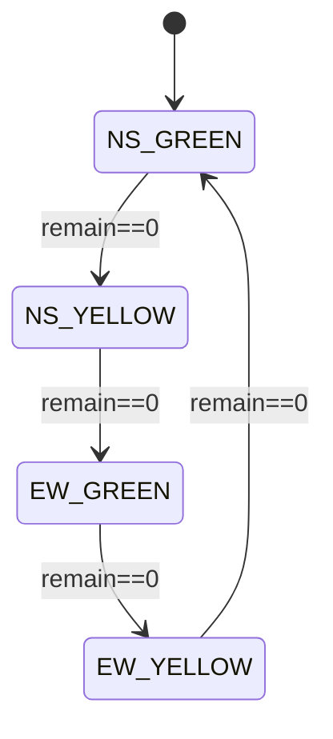

# WebSocket JSON 协议

PC（FastAPI）为 **服务端**，路径：

- `/ws/ui` — 浏览器前端订阅状态（下行）。
- `/ws/device` — ESP32 主控连接（下行状态；可上行心跳）。

## 下行：`type: "state"`

约 **5 次/秒**（相位内部 0.2s tick）广播，相位切换时同样更新。

```json
{
  "type": "state",
  "phase": "NS_GREEN",
  "remain_s": 17,
  "total_s": 25,
  "yellow_s": 3,
  "flow_per_min": { "N": 12, "S": 9, "E": 4, "W": 3 },
  "green_ns_next": 25,
  "green_ew_next": 18
}
```

### 字段说明

| 字段 | 含义 |
|------|------|
| `phase` | `NS_GREEN` / `NS_YELLOW` / `EW_GREEN` / `EW_YELLOW` |
| `remain_s` | 当前子相位剩余秒数（向上取整展示） |
| `total_s` | 当前子相位总时长（绿灯为本次绿灯秒数，黄灯为 `yellow_s`） |
| `yellow_s` | 黄灯固定时长（与配置一致） |
| `flow_per_min` | 各方向过线计数折算的 **辆/分钟**（滚动窗口） |
| `green_ns_next` | 进入下一南北绿灯前，根据流量预估的南北绿灯秒数（展示用） |
| `green_ew_next` | 东西向同理 |

## 上行（设备 → PC）：心跳

ESP32 主控建议 **每 10s** 发送：

```json
{
  "type": "heartbeat",
  "device": "main",
  "rssi": -58,
  "uptime": 12345
}
```

PC 端当前实现为 **记录日志**，不参与配时逻辑。

## 两相位时序



- 进入 `NS_GREEN` 前根据 `(flow_N+flow_S)` 计算南北绿灯时长；进入 `EW_GREEN` 前根据 `(flow_E+flow_W)` 计算东西绿灯时长。
- 黄灯时长固定，由配置 `yellow_seconds` 决定。
